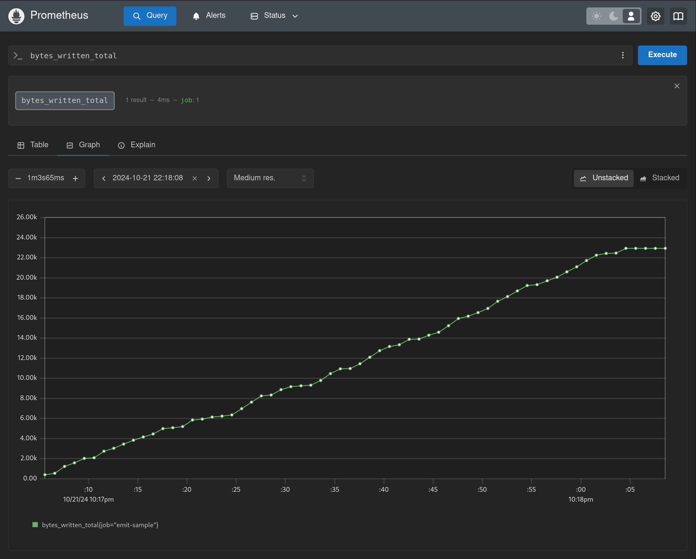

# Metrics

Metrics are an effective approach to monitoring applications at scale. They can be cheap to collect, making them suitable for performance sensitive operations. They can also be compact to report, making them suitable for high-volume scenarios. `emit` doesn't provide much infrastructure for collecting or sampling metrics. What it does provide is a standard way to report metric samples as events.

A standard kind of metric is a monotonic counter, which can be represented as an atomic integer. In this example, our counter is for the number of bytes written to a file, which we'll call `bytes_written`. We can report a sample of this counter as an event using some [well-known properties](./metrics/data-model.md):

```rust
# extern crate emit;
# fn sample_bytes_written() -> usize { 4643 }

let sample = sample_bytes_written();

emit::emit!(
    "{metric_agg} of {metric_name} is {metric_value}",
    evt_kind: "metric",
    metric_agg: "count",
    metric_name: "bytes_written",
    metric_value: sample,
);
```


```text
Event {
    mdl: "my_app",
    tpl: "{metric_agg} of {metric_name} is {metric_value}",
    extent: Some(
        "2024-04-29T10:08:24.780230000Z",
    ),
    props: {
        "evt_kind": metric,
        "metric_name": "bytes_written",
        "metric_agg": "count",
        "metric_value": 4643,
    },
}
```

To learn more about `emit`'s macro syntax, see [Template syntax and rendering](../reference/templates.md).

-----



_A metric produced by [this example application](https://github.com/emit-rs/emit/tree/main/examples/metric_prometheus) in Prometheus._
